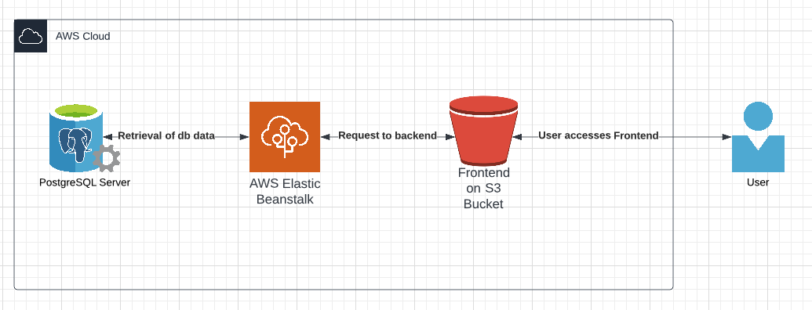

# Infrastructure

## Description

A user is able to navigate to the website (Hosted on a Static Website on a S3 Bucket) and perform a action (e.g. registering, login, uploading a photo)

When that is the case, the Frontend makes a CORS to the Backend (AWS Elastic Beanstalk with underlying S3 Bucket) to retrieve or insert data. 

The Backend (API) is then able to access the PostgreSQL Server (RDS Instance of AWS) and insert or create new data in the server.

Files are stored on the S3 Bucket, since they cannot be on the RDS.
