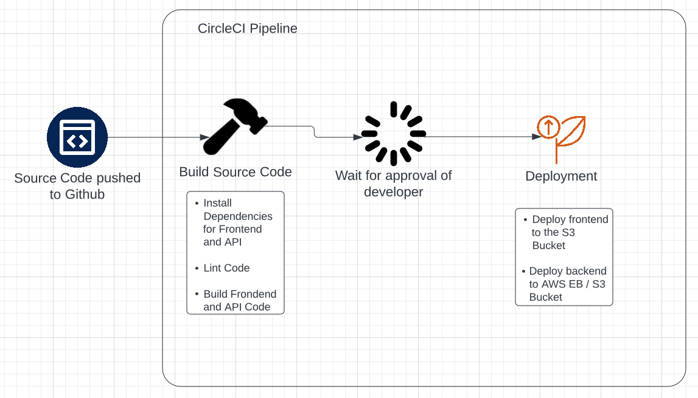

# Pipeline

## Process

### Dev Action
- The Developer has completed his work and pushes it to GitHub.

### Build Source Code
- Then the Code that was uploaded is taken by CircleCI and a Pipeline is triggered. 
-  While Building, all of the dependencies for the frontend and the api are installed.
- When that is complete, the code is linted.
- Finally the Frontend and the API is Built.

### Dev Action
- The Developer(s) is then prompted to approve of the change to start the deployment

### Deployment
- In this part the frontend is deployed to the respective S3 bucket
- The Backend/API is deployed to Elastic Beanstalk with an underlying S3 Bucket holding the code. 

Now the Application can be accessed.
